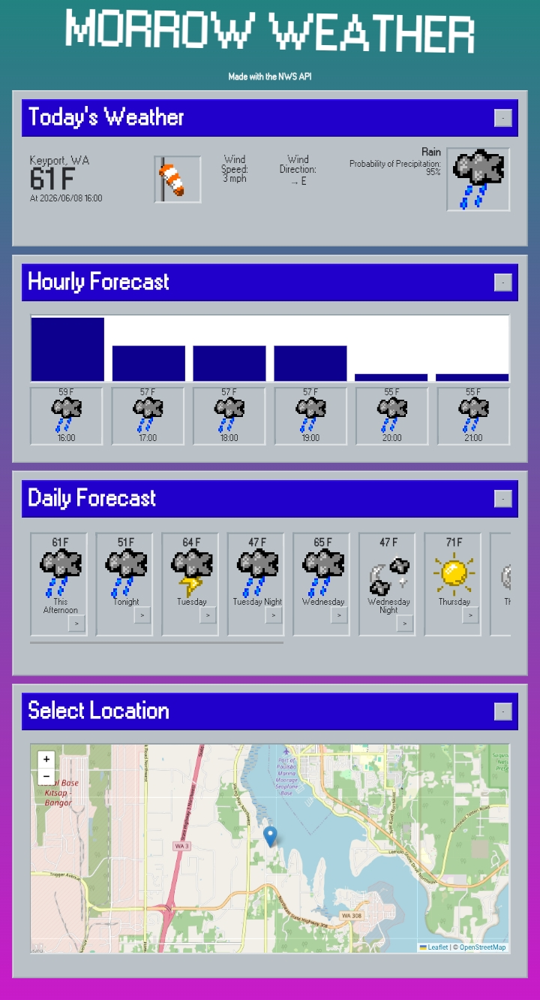
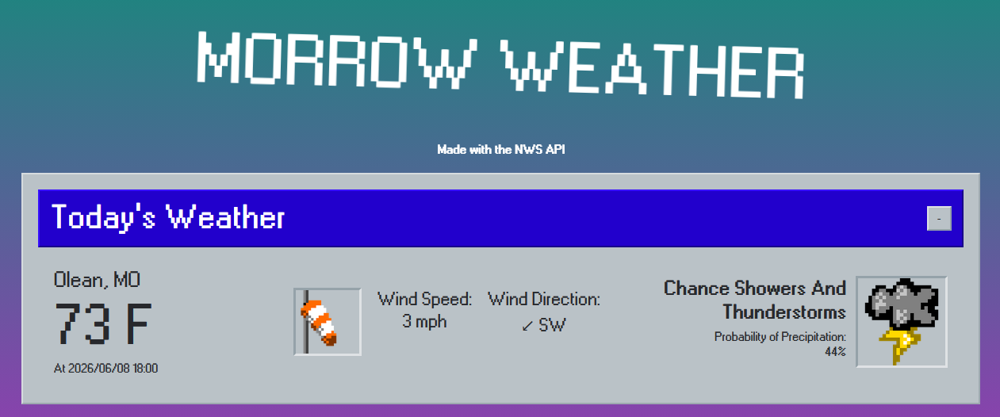
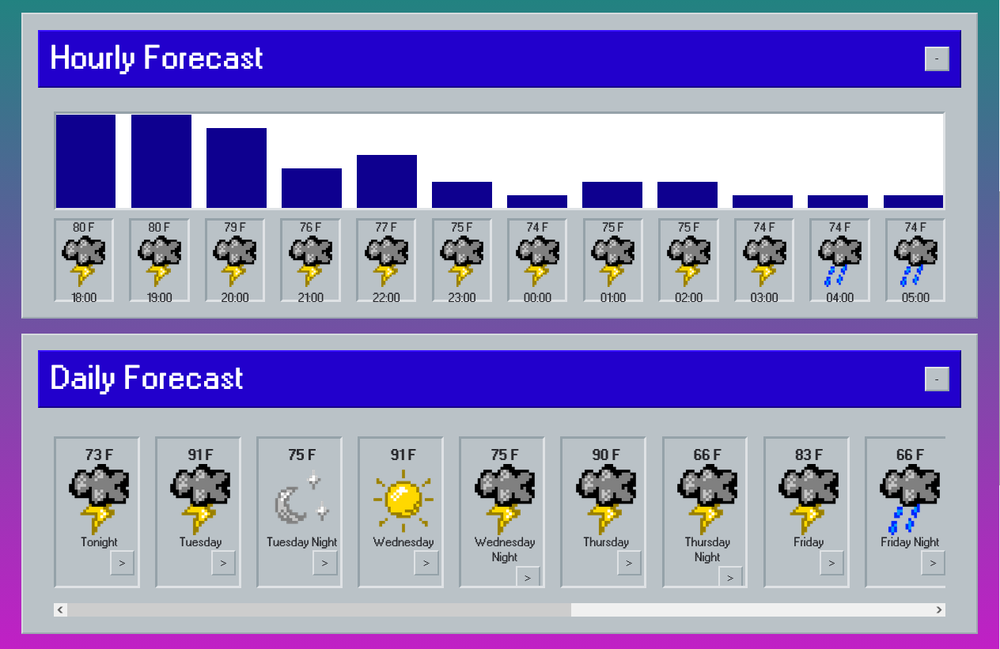

# Morrow Weather Dashboard


A small webcore inspired weather dashboard for the us. 

There is a live demo up at https://morrow-dashboard.vercel.app/!

## Description

The dashboard has sections for hourly and daily forecast, including a small graph for each day or night you choose. The icons for weather conditions were made by me.

On a cellphone:


On a PC:



This is my first web project! So I was motivated to learn about APIs, frontend development and other things about web applications. I *did* get the idea for a weather dashboard form ChatGPT but other than that everything was made by me AI free. Could I have made this with a JavaScript framework to avoid all the spaghetti code? Maybe. As I said I don't do web development often.

## How it works

The website automatically detects your location through the JavaScript geolocation api tho you can input another one in the map section at the bottom.

It also uses the api provided by the United States [National Weather Service](https://www.weather.gov/documentation/services-web-api), plus the [Leaflet JS](https://leafletjs.com/) library for fetching OpenStreetMaps map data.

Since this project uses the NWS api, weather is only available for US locations. Fun fact: I dont live in the US! So there may be a couple of bugs regarding the location of the user.

## Tech Stack

This project is made with HTML, vanilla JavaScript and the SASS preprocessor for CSS. Since it uses the JavaScript fetch API to access weather information, there is no need for a backend and the website can run entirely on the browser.

## Running Locally

You can compile the .scss code with Dart SASS by running:
```
sass sass/styles.scss css/styles.css
```